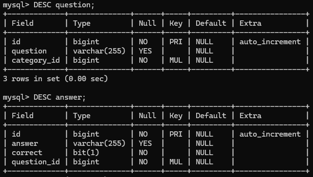
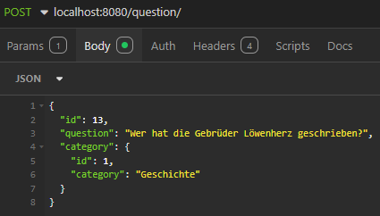
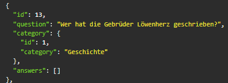
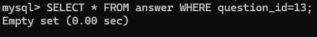
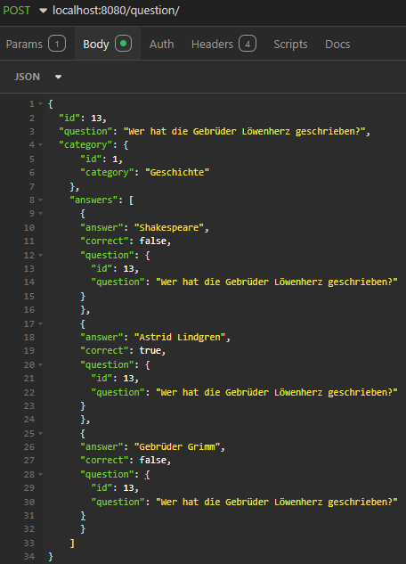
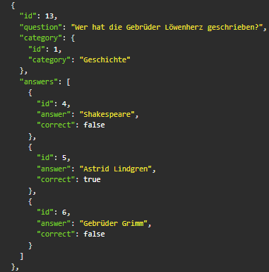
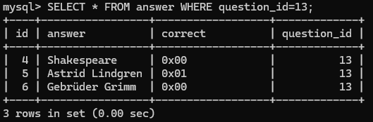

# WISS-Quiz-Project
Für die Zwischenprüfung des Moduls 295 "Backend für Applikationen realisieren" mussten wir das Wiss_Quiz Projekt mit den Anforderungen von den Sidequests 3B, 3C und 4B bearbeiten.


## Inhaltsverzeichnis
- [WISS-Quiz-Project](#wiss-quiz-project)
  - [Inhaltsverzeichnis](#inhaltsverzeichnis)
  - [SQ3B Beziehungen mit Objektrelationalem Mapping](#sq3b-beziehungen-mit-objektrelationalem-mapping)
    - [Ausgangslage](#ausgangslage)
    - [Wissens-Check](#wissens-check)
      - [Wie werden Beziehungen zwischen zwei Datenklassen mit JPA definiert?](#wie-werden-beziehungen-zwischen-zwei-datenklassen-mit-jpa-definiert)
      - [Was passiert, wenn man einen Category-Datensatz löscht, zu dem es Question-Datensätze gibt?](#was-passiert-wenn-man-einen-category-datensatz-löscht-zu-dem-es-question-datensätze-gibt)
      - [Wie arbeiten der Controller und Repository zusammen?](#wie-arbeiten-der-controller-und-repository-zusammen)
    - [Erkenntnisse](#erkenntnisse)
  - [SQ3C Benutzerdefinierte REST-Controller und ORM-Repositories](#sq3c-benutzerdefinierte-rest-controller-und-orm-repositories)
    - [Wissens-Check](#wissens-check-1)
      - [Welche Funktionen sind in den Repository-Interfaces bereits vorhanden?](#welche-funktionen-sind-in-den-repository-interfaces-bereits-vorhanden)
      - [Was ist zu tun, wenn man für eine bereits mit JPA persistierte Student-Klasse alle Datensätze mit einem bestimmten Nachnamen oder Wohnort finden will?](#was-ist-zu-tun-wenn-man-für-eine-bereits-mit-jpa-persistierte-student-klasse-alle-datensätze-mit-einem-bestimmten-nachnamen-oder-wohnort-finden-will)
    - [Erkenntnisse](#erkenntnisse-1)
  - [SQ4B Validierung](#sq4b-validierung)
    - [Erkenntnisse](#erkenntnisse-2)
  - [Fachbegriffe](#fachbegriffe)


## SQ3B Beziehungen mit Objektrelationalem Mapping

### Ausgangslage


<p>In dieser Sidequest lernen wir wie man eine REST-API mit Datenbank-Anbindung für das Wiss-Quiz zu erstellen.</p>

**Codebeispiel:**
```java
@Entity
@Table(name="question")
public class Question {

    @Id
    @GeneratedValue(strategy=GenerationType.IDENTITY)
    private Integer id;
    private String question;

    @ManyToOne(fetch = FetchType.EAGER, optional = false)
    @JoinColumn(name = "category_id", nullable = false)
    private Category category;

    /** ommitted all other SETTER/GETTERs */

    public void setCategory(Category cat) {
        this.category = cat;
    }

    public Category getCategory() {
        return category;
    }
}
```

### Wissens-Check
#### Wie werden Beziehungen zwischen zwei Datenklassen mit JPA definiert?
<p>In JPA werden Beziehungen zwischen Datenklassen (Entitäten) durch sogenannte Annotations definiert. Untenstehend die häufigsten Beziehungstypen:</p>

**Einz-zu-Eins-Beziehung (OnetoOne)**
```java
@Entity
public class Person {
    @Id
    @GeneratedValue(strategy = GenerationType.IDENTITY)
    private Long id;

    @OneToOne
    @JoinColumn(name = "address_id")
    private Address address;
}

@Entity
public class Address {
    @Id
    @GeneratedValue(strategy = GenerationType.IDENTITY)
    private Long id;

    // weitere Attribute
}
```

**Eins-zu-Viele-Beziehung (OnetoMany)**
```java
@Entity
public class Category {
    @Id
    @GeneratedValue(strategy = GenerationType.IDENTITY)
    private Long id;

    @OneToMany(mappedBy = "category")
    private List<Question> questions;
}

@Entity
public class Question {
    @Id
    @GeneratedValue(strategy = GenerationType.IDENTITY)
    private Long id;

    @ManyToOne
    @JoinColumn(name = "category_id")
    private Category category;
}
```
**Viele-zu-Viele-Beziehung (ManytoMany)**
```java
@Entity
public class Student {
    @Id
    @GeneratedValue(strategy = GenerationType.IDENTITY)
    private Long id;

    @ManyToMany
    @JoinTable(
        name = "student_course",
        joinColumns = @JoinColumn(name = "student_id"),
        inverseJoinColumns = @JoinColumn(name = "course_id")
    )
    private List<Course> courses;
}

@Entity
public class Course {
    @Id
    @GeneratedValue(strategy = GenerationType.IDENTITY)
    private Long id;

    @ManyToMany(mappedBy = "courses")
    private List<Student> students;
}
```

<ins>**Wichtige Annotationen**</ins>

`@JoinColumn`
<p>Gibt die Spalte an, die als Fremdschlüssel verwendet wird.</p>

`@JoinTable`
<p>Wird verwendet, um eine Zwischentabelle für Viele-zu-Viele-Beziehungen zu definieren.</p>

#### Was passiert, wenn man einen Category-Datensatz löscht, zu dem es Question-Datensätze gibt?

<p>Es hängt ab wie die Cascade Option definiert wurde. In unserem Fall ist es CascadeType.ALL was bedeutet dass wenn die Category gelöscht wird, alle verknüpften Question-Datensätze ebenfalls gelöscht werden.</p>

#### Wie arbeiten der Controller und Repository zusammen?

1.  Der Controller nimmt eine Anfrage vom Benutzer entgegen.
2. Der Controller sagt dem Repository, was es tun soll, z. B. Daten abrufen oder speichern.
3. Das Repository führt die Datenbank-Operationen aus und gibt die Daten an den Controller zurück.
4. Der Controller gibt dem Benutzer das Ergebnis zurück (z. B. als JSON-Antwort oder Webseite).

<p>Man kann sich den **Controller** als "Kellner" vorstellen der die Bestellungen der Gäste (Benutzer) entgegennimmt.</p>
<p>Die Küche ist das Repository, die die Bestellungen verarbeitet, indem es die benötigten Zutaten (Daten) aus der Speisekammer (Datenbank) holt.</p>

### Erkenntnisse
<p>Ich erhielt ständig die Fehlermeldung dass irgendetwas nicht stimmte mit der question_id. Der JSON Code sah wie folgt aus:</p>

```json
{
	"id": 13,
	"question": "Wer hat die Gebrüder Löwenherz geschrieben?",
	"category": {
			"id": 1,
			"category": "Geschichte"
		},
		"answers": [
			{
			"answer": "Shakespeare",
			"correct": false,
			"question_id": 13
			},
			{
			"answer": "Astrid Lindgren",
			"correct": true,
			"question_id": 13
			},
			{
			"answer": "Gebrüder Grimm",
			"correct": false,
			"question_id": 13
			}
		]
}
```

<p>Beim Überprüfen der Datenbank ist mir folgendes aufgefallen:</p>



<p>Die category_id wird nirgends im JSON verwendet sondern wird als Nested Objekt angezeigt. Hierbei handelt es sich wohl um den Fremdschlüssel:</p>

```json
	"category": {
			"id": 1,
			"category": "Geschichte"
		},
```
<p>Nach dieser Erkenntnis, habe ich die question_id angepasst damit diese ebenfalls wie ein Nested Objekt strukturiert ist:</p>

```json
{
	"id": 13,
	"question": "Wer hat die Gebrüder Löwenherz geschrieben?",
	"category": {
			"id": 1,
			"category": "Geschichte"
		},
		"answers": [
			{
			"answer": "Shakespeare",
			"correct": false,
			"question": {
				"id": 13,
				"question": "Wer hat die Gebrüder Löwenherz geschrieben?"
			}
			},
			{
			"answer": "Astrid Lindgren",
			"correct": true,
			"question": {
				"id": 13,
				"question": "Wer hat die Gebrüder Löwenherz geschrieben?"
			}
			},
			{
			"answer": "Gebrüder Grimm",
			"correct": false,
			"question": {
				"id": 13,
				"question": "Wer hat die Gebrüder Löwenherz geschrieben?"
			}
			}
		]
}
```

<p>Ich erhielt immernoch eine Fehlermeldung, diesmal jedoch eine andere. Ich habe festgestellt, dass man zuerst die Question erstellen muss bevor man dann die Answers hinzufügen kann: </p>





<p>Wie man sieht ist der "answers": [] leer. Nach dem erstellen kann man dann die answers einfügen:</p>





## SQ3C Benutzerdefinierte REST-Controller und ORM-Repositories
 <p>In dieser Sidequest erweitern wir das bisherige Projekt um die zusätzliche Funktionalität, dass ein komplettes Quiz für eine bestimmte Kategorie geladen wird. Ein Quiz beinhaltet drei zufällige Fragen zu einer gegebenen Kategorie.</p>

### Wissens-Check

#### Welche Funktionen sind in den Repository-Interfaces bereits vorhanden?
<p>Da wir unsere Interfaces auf CrudRepository erweitert haben gibt es zusätzliche Methoden die wir nutzen können:</p>

<ul>
<li>count()</li>
<li>delete(T entity)</li>
<li>deleteAll()</li>
<li>findAll()</li>
<li>findAllById(Iterable<ID> ids)</li>
<li>findById(ID id)</li>
<li>save(S entity)</li>
</ul>

<p>Unter folgendem Link gibt es mehr Informationen zu den Methoden des Interfaces:</p>

[CrudRepository](https://docs.spring.io/spring-data/commons/docs/current/api/org/springframework/data/repository/CrudRepository.html)

#### Was ist zu tun, wenn man für eine bereits mit JPA persistierte Student-Klasse alle Datensätze mit einem bestimmten Nachnamen oder Wohnort finden will?
<ul>
<li>Die Student Klasse mit den Attributen Nachname und Wohnort definieren und Getter/Setter hinzufügen.</li>
<li>Im StudentRepository die Methoden hinzufügen wie bei dieser Aufgabe in QuestionRepository.</li>

```java
// Methode zum Finden aller Studenten mit einem bestimmten Nachnamen
    List<Student> findByNachname(String nachname);

    // Methode zum Finden aller Studenten, die in einem bestimmten Wohnort leben
    List<Student> findByWohnort(String wohnort);
```
<li>Methode verwenden im Controller sowie das Beispiel von dieser Sidequest im QuizController</li>

```java
public class StudentController {

    @Autowired
    private StudentRepository studentRepository;

    @GetMapping("/nachname/{nachname}")
    public List<Student> getStudentsByNachname(@PathVariable String nachname) {
        return studentRepository.findByNachname(nachname);
    }

    @GetMapping("/wohnort/{wohnort}")
    public List<Student> getStudentsByWohnort(@PathVariable String wohnort) {
        return studentRepository.findByWohnort(wohnort);
    }
}
```
<li>Nachdem sollte man mit der URL /nachname/Max oder /wohnort/Gossau alle Datensätze finden mit dem angegebenen Nachnamen oder Wohnort.</li>
</ul>


### Erkenntnisse
<p>In dieser Sidequest hatte ich grösstenteils keine Probleme. Die einzigen Schwerpunkte waren die korrekten imports zu nutzen, da mir der Quickfix immer das Falsche angab. Ausserdem war in der Aufgabenstellung das falsche Repository angegeben. Die Methode musste in der QuestionRepository und nicht in der QuizRepository.</p>

## SQ4B Validierung

<p>In dieser Sidequest erweitern wir unser Projekt mit hilfreichen Fehlermeldungen und Validierungen.</p>

### Erkenntnisse
<p>Ich erkannte dass man die Methoden für die Exceptionhandler in separaten Files im exception folder speichern sollte anstatt diese im ControllerAdvisor hinzuzufügen. Nach dieser Erkenntniss überlegte ich mir wie man das am besten handhabt bei Projekten mit hunderten von Exceptionhandlers da dies schnell unübersichtlich werden kann. Eine Methode wäre es generische Exception-Klassen zu erstellen welche allgemein übergreifen. Wir hätten dies in unserem Projekt machen können, da es das gleiche macht.</p>

## Fachbegriffe
<ins>ORM Object-Relational Mapping</ins>
<p>Ermöglicht Datenbanktabellen (relationale Daten) in Form von Objekten in der Programmiersprache zu verwenden. ORM-Tools verbinden die objektorientierte Welt mit der relationalen Datenbank, indem sie SQL-Abfragen automatisch generieren und die Daten zwischen der Datenbank und den Objekten hin- und herschieben.</p>

<ins>Controller - Verwalter der Anfragen</ins>
<p>Kümmert sich um die Kommunikation zwischen dem Benutzer und der Anwendung. Er nimmt die Anfragen des Benutzers (z. B. in Form von URLs) entgegen und gibt die entsprechenden Antworten zurück.</p>

<ins>Repository - Der Zugang zur Datenbank</ins>
<p>Ist der Teil, der sich um die Datenbank kümmert. Es verwaltet alle Operationen, die mit Daten zu tun haben, wie das Abrufen, Speichern, Aktualisieren oder Löschen von Informationen in der Datenbank.</p>

<ins>Fetchtypes</ins>
<ul>
<li>EAGER</li>

```java
@ManyToOne(fetch = FetchType.EAGER, optional = false)
```
<p>externe Daten werden sofort aus der verknüpften Tabelle geladen (default)</p>
<li>LAZY</li>

```java
@ManyToOne(fetch = FetchType.LAZY)
```

<p>externe Daten werden erst beim Aufruf der entsprechenden GET-Methode aus der verknüpften Tabelle geladen</p>
</ul>


`ResponseEntity<Category>`
<p>Eine Klasse die HTTP-Antworten (Responses) in SpringBoot beschreibt. Sie kann
Statuscodes, Header und dein eigentlichen Rückgabewert enthalten. In diesem Fall ein Category-Objekt.</p>

```java
@PostMapping("/") // Map ONLY POST Requests
    public ResponseEntity<Category> createCategory(@RequestBody Category category) {
        category = categoryRepository.save(category);
        return ResponseEntity.ok().body(category);
    }
```

`@Autowired`
<p>Mit der @AutoWired Annotation über dem Attribut erstellt das Springboot-Framework automatisch ein Objekt für dieses Interface.
Es sagt Spring Boot: „Gib mir das CategoryRepository-Objekt, ohne dass ich es explizit erstellen muss.</p>

```java
@Autowired
    private CategoryRepository categoryRepository;
```
`@PathVariable long id`
<p>Wird verwendet, um einen Teil der URL als Parameter zu übernehmen. Wenn die URL zum Beispiel http://localhost:8080/category/5 lautet, wird 5 als Wert für id übernommen.</p>

```java
    @DeleteMapping("/{id}")
    public ResponseEntity<String> deleteCategory(@PathVariable long id) {
        categoryRepository.deleteById(id);
        return ResponseEntity.ok().body("Category " + id + " deleted.");
    }
```

`@Entity`
<p>Die Klasse entspricht einer Tabelle in der Datenbank</p>

`@Table(name="question")`
<p>Die Klasse die als Entity definiert ist, ist mit der Tabelle namens 'question' in der Datenbank verknüpft</p>

`@Id`
<p>Kennzeichnet den Primärschlüssel</p>

`@GeneratedValue(strategy=GenerationType.IDENTITY)`
<p>Die Datenbank ist dafür verantwortlich, den Primärschlüssel zu generieren, zum Beispiel bei jedem neuen Datensatz in einer Tabelle.</p>

`@JoinColumn(name = "category_id", nullable = false)`
<p>Gibt die Spalte an, die als Fremdschlüssel verwendet wird.</p>

`@JoinTable`
<p>Wird verwendet, um eine Zwischentabelle für Viele-zu-Viele-Beziehungen zu definieren.</p>